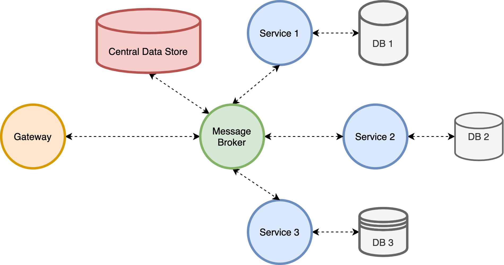

# Eventual Completion for Microservices

## Introduction

Our goal is to apply fault tolerance to must-complete distributed transactions in the microservice architecture. As software systems become increasingly complex, many of them turn toward distributed architecture. With the help of virtualization and containerization, microservice architecture is adopted by many systems. In microservices, data are partitioned into several business domains to form a loosely-coupled architecture that can be updated and deployed independently. This also increases the modularity of the entire system, leading to less maintainence effort and faster deployment speed. Although most operations can be done within the same business domain, it is hard to perform traditional ACID transactions because of the possibility of network partition as data become distributed across several databases. The distributed nature results in uncertain behavior of a transaction.

This problem is especially serious in some critical system, including e-commerce websites. For example, if a customer had already complete a payment process while the system encounter a failure before this payment is persisted and the record is completely lost, it could lead to severe damage to customer relationship. As more and more third-party service integration is used in today's websites, this problem could happen more frequently because most of them are not idempotent. To prevent this type of problems, it is crucial to design a fault-tolerance mechanism to deal with this situation.

Among the previous methods, all of them focused on data consistency and isolation, in order to avoid the unstable states of distributed systems while executing transactions to be read; however, these methods cannot deal with technical errors, they can only roll back transactions due to business errors. We would like to design a fault tolerant system that can update technical errors or recover them.

## Transaction Model

We define the transaction model as the following to simplify the reasoning process.

### Architecture

 

### Assumptions

- Microservice architecture
  - A gateway to receive from and respond to users
  - A set of services and corresponding databases, each services may have multiple instances
  - A message broker, with a queue and control instances to dispatch events
  - A central data store to store globally visible information that spans across multiple services (there can be several databases, but only shown one in the architecture picture)
- Event-based architecture 
  - Asynchronous execution to reduce failure surface
  - Message queue, message broker as storage and executor
  - Message can be passed through synchronous method like HTTP or gRPC but in a step-wise fashion (more details later)
  - The communication between each component is through an **event**: a set of key-value pairs, usually in the form of json, xml, or protocol buffer.
- Heterogenious environment
  - RDB, KV store, Document DB, Time series DB, Event Store...
  - Bare-bone machine, virtual machine, containers, ...
- Database Constraints
  - All databases are durable, i.e. once a data is **commited** to the database, it will not disappeared on failures
  - All local transactions performed by databases are **atomic** (all-or-nothing atomicity)
  - Some database may not support transactions
  - All single operation in any database are **atomic** (before-or-after atomicity)
- Allow default configuration for some services
  - The location of the message broker, central data store, ...
  - Default retry configuration, the number of instances, ... 

### Requirements

- Each request must-complete, cannot lead to inconsistent state of data
- The execution time of the each request is bounded, usually within several hours
- Allow rollback to a certain point when facing errors
- Allow intervention of developer (to manipulate the state of the execution context)
- Need the ability to deal with several types of errors
  - Business errors: the program logic is correct, but an user performed an illegal operation
  - Techinical errors: the program logic is still corrects, but it will subject to the interaction between components and environments, e.g. network partition, power failure, memory killer, ...
  - Logical errors: the program is buggy, e.g. infinite loop
- Need to support versioning (v1, v2, ...) to easier deployment and not affect the current execution sequences
- Have execution pivot point (rollback until this point) 
  - The integration with third-party services or non-idempotent actions usually cannot rollback or it will lead to unexpected consequences
- Prefer transparent to each service (by using agent or middleware)
- Prefer easier programming style
- Prefer data isolation (cannot been seen by other service until the transaction is complete)
  - Not allow interleaved transactions

### Execution Model

- A tree of transactions starts from root transaction.
- A transaction can be composed of nonterminal or terminal transaction.
- A nonterminal node can be described as a sequence of terminal nodes
- A terminal node can be described as a tuple of (Service, Endpoint, Action, Version, Stage, Input, Output, Next Service).
    - (Payment, /v1/payment, retry, v1, stage3, input{}, output{}, Order)

### Execution Context

- Transaction ID (trace ID)
- Start Time
- End Time (optional)
- Default retry time (8 times)
- Current retry Time
- Time to Live (total retry time + service time)
- Trace stack (stages had been executed)
- Rollback stack (compensation stages)
    - [payment/v1/rollback, order/v2/order/rollback]
- Next Stage (Service, Endpoint, Action, Version, Stage, Input)
- State (pending, processing, complete) (locking)
- [custome fields ...] (optional)

### Execution Behavior

- The root generates a transaction id and add start time.
- The final node make the end time.
- The root marked the state as pending. The first service mark the state as processing. The final state mark the state as complete.
- Each node take the input from the context and output the next stage information including the output data
- Each node add the stage information (Service, Endpoint, Action, Version, Stage) to the trace stack.
- Each node add the rollback information (Service, Endpoint, Action, Version, Stage) to the rollback stack.
- Each node decrease the TTL by 1 after processing.
- If the exection failed as this stage, the retry time is decreased by 1. If success, then mark current retry time as -1.
- If the node see the current retry time is -1, then mark the current retry time as the default retry time for that service. Or it will use the default retry time specified in the execution context.
- If either TTL or retry time becomes 0, or any error occurs (rollback or cancel), the execution ends.

## Fault Model

This fault model mainly deals with the faults from the environments of the interactions between components. The logic error of the execution flaws are not considered. This type of error need to be addressed by the developer itself or through some verification processes like testing.

## Mechanism

- We can add some restrainted to the developer
  - Change the programming style, like mapreduce
  - Initial setup for each services
  - Use an alternative library with the same API interface
- Error notification can be sent to the developer as the last resort

TODO

## Simulation

### Implementation

TODO

### Testing

TODO

## References

- [SagaMAS: A Software Framework for Distributed Transactions in the Microservice Architecture](https://ieeexplore.ieee.org/abstract/document/8645853)
    - Provides a good formalized transaction model
    - Use agent at each service to handle distributed transactions (semi-orchestrated)
- [Enhancing Saga Pattern for Distributed Transactions within a Microservices Architecture](https://www.mdpi.com/2076-3417/12/12/6242)
    - Data Isolation using quota queue and commit-sync service
- [Limits of Saga Pattern](https://www.ufried.com/blog/limits_of_saga_pattern/#fnref:2)
    - Only handle business error, not techinal error
- [Application-Level Locking](https://stackoverflow.com/questions/5436021/implementing-application-level-locking)
- [2PC*: a distributed transaction concurrency control protocol of multi-microservice based on cloud computing platform](https://link.springer.com/content/pdf/10.1186/s13677-020-00183-w.pdf) 
- [Event-based data-centric semantics for consistent data management in microservices](https://dl.acm.org/doi/abs/10.1145/3524860.3539807?casa_token=101CsEviepkAAAAA:ZJb00U-bd7XInIMk9O6-pyS8UHveeJAAaEroeWHedRF2l0UJAXyVcJvkKgmLNiPoFmFBV5Nqi60dXQM)