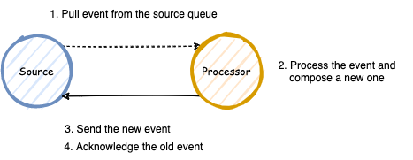
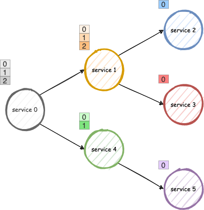

# Hierarchical Saga Transactions

This is the final project of the course 2022 NTUEE Fault-Tolerance Computing. 

**Note:** We write a simulator in Go to simulate distributed services because of the short duration of a semester. We envision a realistic architecture using containers and Kubernetes for deployment.

## Introduction

We aim to apply fault tolerance to must-complete distributed transactions in the microservice architecture. As software systems become increasingly complex, many turn toward distributed architecture. With the help of virtualization and containerization, microservices architecture is adopted by many systems. In microservices, data are partitioned into several business domains to form a loosely-coupled architecture that can be updated and deployed independently. This also increases the modularity of the entire system, leading to less maintenance effort and faster deployment speed. Although most operations can be done within the same business domain, it is hard to perform traditional ACID transactions because of the possibility of network partition as data become distributed across several databases. The distributed nature results in uncertain behavior of a transaction.

This problem is severe in some critical systems, including e-commerce websites. For example, suppose a customer has already completed a payment process while the system encounters a failure before this payment is persisted and the record is completely lost. In that case, it could lead to severe damage to customer relationships. As more and more third-party service integration is used in today's websites, this problem could happen more frequently because most are not idempotent. To prevent this type of problem, it is crucial to design a fault-tolerance mechanism to deal with this situation.

To solve this problem, people turn to Long-Lived Transactions (TTL) or **Saga**, in the microservice term. This type of transaction is assumed to be lived longer than standard transactions and thus relax some classic ACID transaction constraints. The developer avoids using global transactions (GT) but uses local transactions (LT) instead to improve concurrency and performance at the cost of data consistency. 

Among the previous works, the Saga can only deal with flat transactions. However, there may be the need to extend these constraints to support hierarchical transactions to make them more flexible in a more complex environment. In this project, we design a mechanism that can be used to achieve hierarchical saga transactions, and we also write a simple simulation program to demonstrate the behavior.

**Our Contribution:**

- We design a hierarchical saga transaction mechanism based on event-driven microservice architecture by introducing the concept of control endpoints and a transaction manager.
- We improve the transactional messaging pattern by introducing an additional tag to prevent collision between duplicate events.


## Related Work

- [SagaMAS: A Software Framework for Distributed Transactions in the Microservice Architecture](https://ieeexplore.ieee.org/abstract/document/8645853)
- [Enhancing Saga Pattern for Distributed Transactions within a Microservices Architecture](https://www.mdpi.com/2076-3417/12/12/6242)
- [Limits of Saga Pattern](https://www.ufried.com/blog/limits_of_saga_pattern/#fnref:2)
- [Application-Level Locking](https://stackoverflow.com/questions/5436021/implementing-application-level-locking)
- [2PC*: a distributed transaction concurrency control protocol of multi-microservice based on cloud computing platform](https://link.springer.com/content/pdf/10.1186/s13677-020-00183-w.pdf) 
- [Event-based data-centric semantics for consistent data management in microservices](https://dl.acm.org/doi/abs/10.1145/3524860.3539807?casa_token=101CsEviepkAAAAA:ZJb00U-bd7XInIMk9O6-pyS8UHveeJAAaEroeWHedRF2l0UJAXyVcJvkKgmLNiPoFmFBV5Nqi60dXQM)

## Fault Tolerance Design

In this section, we will discuss a mechanism step-by-step to construct a hierarchical saga transaction.

### Fault Model

Our fault model mainly deals with the faults from the environments of the interactions between components. The logic error of the execution flaws is not considered. This type of error needs to be addressed by the developer or through verification processes like testing.

There are three types of errors:

- **Business Error:**
  - This type of error is valid from the viewpoint of our systems. It can be viewed as a non-error transaction with the business rollback stage. We omit further discussion by treating it as a special case of technical error.
- **Technical Error:**
  - Service Failure: the service is temporarily shut down or crashed.
  - Network Partition: the network connection failed when communicating with another component.
  - We can distinguish these two conditions because network partition usually results in a timeout error rather than a not-found error. We mainly deal with this type of error in our system.
- **Logical Error:**
  - The most notable error in this category is programming bugs like an infinite loop.
  - This type of error is only mentioned a little bit during our discussion.

With our use of an event-driven system, we can eliminate many common errors in a synchronous system. However, we have to deal with another complexity, that is, sending the event to the event queue. Through observation, we can mask the failures by using variants of retry to achieve *exactly-once processing*. But before we dive deeper into resolving this issue, we first look at the properties of the basic building block in an event-driven system.

### Basic Unit

We can decompose the operation sequence into basic units of source and processor. There are four possibilities that the basic unit can fail.



**Normal Operation:** The processor pulls an event from the source and processes it. After completing the processing, send a new event and acknowledge the old one.

(1) The processor fails to pull an event from the source. Because nothing has happened, we can retry.

(2) The processor failed in the processing of the event. It is the developers' responsibility to deal with this situation by using some form of transaction.

(3), (4) While the event has been processed, it fails to send the new event or acknowledge the old one. Because the processor is stateless, we can do nothing but retry. However, this could lead to duplicate messages. We handle this situation in the next section *Transactional Messaging*.

In an event-driven system, the basic unit is the only source of failure. We can achieve a high degree of fault tolerance by dealing with all failures in the basic unit.

### Transactional Messaging 

Transactional messaging treats updating DB and sending an event as a whole as if it were a transaction. There are three types:

- Polling: Let the system periodically pull the modifying entry and put them in the event queue.
- Change Data Capture: Like polling, but using additional components that pull the database's log. Ex: Kafka Connect
- Blind Retry: This does nothing but design the service as an idempotent component, so retries are not a problem.

The first solution is easy to implement but inefficient. The second solution has high performance but only supports some kinds of applications. The third one is the most general but also the hardest to handle to achieve idempotency. We will discuss how to improve the third solution later.

**Change Data Capture (CDC):**

Although we discuss three possible solutions, the first two can be thought of as the same approach. While the polling solution is based on fixed-time querying, the CDC approach is driven by interrupts.

Normal Operation: The service issues a transaction and then sends an acknowledgment of the old event.

(1) If (1) fails, we can retry.

(2) As we use transactions, the service knows that this event has been processed and can safely ignore it.

The CDC component does the delivery of the new event. Nevertheless, the CDC may also fail and send duplicate events. Fortunately, with the help of specialized `DB Schema`, we can solve the problem.


**Blind Retry:**

Although CDC is a great technology, many applications can not use this approach because of a lack of support from the database. Those applications can only use blind retries to deal with technical errors. In most situations, it suffices. Nevertheless, when a transaction encounters successive failures in the flow of the transaction, it could lead to an exponential growth of the duplicate events, as shown in the figure below:


Suppose one failure can cause two duplicate events. After n successive failures, it could cause 2 to the power of n duplicate events, which is intolerable and will cause the entire system to halt because of the flooding of duplicate events.

Thankfully, this can be mitigated by inserting another field `Tag` in the outbox table. See `DB Schema` for more discussion. 


By employing this change, we suppress the duplicate events at each stage to make it grow pseudo-linearly like the CDC approach.

**DB Schema:**

To deduplicate events, we introduce an additional outbox table to store the information on transactions. Typical practice is explained below:

- Outbox Table: This table tracks the progress of the transaction. We insert an entry containing `TxID` to declare that the transaction has performed some operations on this database.
- Data Table: This is the normal table we will write data into. If we want to implement semantic locking, we can also add `TxID` and `State` in the data table.

By modifying the Outbox table and the Data table in a single transaction, only the first event will update the table successfully, and the rest will fail. However, this approach has some defects:

- First, if a service has to update the same database table more than once in separate transactions, this mechanism breaks.
- Second, as shown in the `Blind Retry`, it could lead to an exponential growth of duplicate events in certain situations.

To mitigate the problem, we add two other fields: `Stage` and `Tag`, in the outbox table to differentiate duplicate events. 

- `Stage`: This is a local database transaction identifier. The field differentiates two local transactions of the same database in a saga.
- `Tag`: This is a random number. As we want to tell different events, we can use a random number by a pseudo-random number generator. Before sending a new event, our framework will assign a random number to the new event. Although there could be collisions, the chances are rare because we have already partitioned events by `TxID` and `Stage`.

With this small change to the original pattern, we can safely retry and increase the idempotency of each atomic unit.

The `State` in the schema is for semantic locking to improve data consistency. We leave the discussion of this field in *Discussion*.

The `Timestamp` field in the outbox table helps us programmatically or automatically expire the entry after a while. The `Timestamp` field in the data table can be used to implement distributed locking.

The `<Rollback>` field can be used to store rollback information like parameters and intermediate states. By keeping the rollback information in the outbox table, we dramatically decrease the size of each event. With this method, each event can only carry a tuple of `(Service, Endpoint, Stage)` in its `RollbackStack`. Along with the `TxID`, we can rollback the operation.


**Note:** Although we use relation database as an example, the mechanism can be applied to other database as long as every single operation of it is atomic. For example, for a document DB, we can formulate the schema as below:

```javascript
{
	outbox: [
		{<tx1>},
		{<tx2>},
		...
	],
	data: [
		{<entry1>},
		{<entry2>},
		...
	]
}
```

It can simultaneously update the outbox field and also the data field.

**Unified representation:**

To simplify the following discussion, we unify the representation of transactional messaging shown in the following figure. The transactional messages will be represented by a dotted line, followed by a solid line followed by a dotted line. The service first pulled an event from its queue. After performing some processing of the event and updating the database, it puts a new event in the queue of the next service.


## Transaction Model

We define the transaction model as the following to simplify the reasoning process.

### Architecture

By employing an event-driven architecture, we rule out many failure cases to improve the fault tolerance of our mechanism. There are several components in this figure:

- **Gateway:** It accepts requests from outside of the system. It performs asynchronously by transforming a synchronous request into an asynchronous event that is later processed by the system. After putting the event in the event queue, it immediately returns the response. The user may periodically probe the system via APIs to check the transaction's status.
- **Event Queue:** The event queue is central to an event-driven architecture. It stores all events in event logs and also provides sharding to improve performance and event routing.
- **Transaction Manager**: This component controls the state of the transaction. It provides the single source of truth of the transaction state. To determine if a transaction is committed or aborted, the user should quest the transaction manager.
- **Services**: The remaining parts of the systems are made up of a set of services that provide the functionality to manipulate the underlying database. They can perform hierarchical saga transactions by coordinating with the event queue and the transaction manager. In production, each service is composed of multiple stateless instance for scalability and availability.

 


### Execution Model

We can model hierarchical saga transactions to a tree of local transactions performed by services. Each service in a tree is composed of several atomic units called **stages**. 



An atomic unit may be a database transaction of a third-party API call. We can define an atomic unit as a block of operations that contains multiple pure functions but only a single impure function.

The `demo_endpoint()` consists of 3 atomic units in the following code blocks. To achieve strong fault tolerance, we must partition them into separate stages. For optimization, see *Discussion*.

```go
func demo_endpoint() {
	// atomic unit 1
	pure1_1()
	pure1_2()
	impure1()
	
	// atomic unit 2
	pure2_1()
	pure2_2()
	pure2_3()
	impure2()
	
	// atomic unit 3
	pure3_1()
	impure3()
}
```

The tree shown at the beginning of this section can be expanded into the following flat execution flow. Actually, they resemble function calls in the computer system.


### Execution Context

To connect different stages, we must pass execution context between them to control their behavior. We only show the required fields down below. Other fields may depend on the implementation. The meaning of each field will be detailed in *Mechanism*.

```yaml
TxID:  TX123456789
Phase: PhaseProcessing
From: PaymentService
To: OrderService
Endpoint: payment
Stage: 0
RetryTime: 3
TTL: 50
CallStack: ["Payment:/v1/payment", "Order:/v1/order"]
Body:
	- key: value
	- ...
```

## Transaction Design

A transaction can be divided into a combination of the following phases: a prepare phase and a sequence of mixed control and data phases.

### Prepare Phase

In the prepare phase, the user sends a request to the gateway and asks to perform a transaction. The gateway transforms the request into an event and sends it to the event queue. After that, the gateway immediately returns to the user. On failures, we can retry and send duplicate events. They will be deduplicated by the transaction manager.


**Note:** This is not a "real" phase, but we can still separate it into a single phase to make the distinction between other formal phases.

### Control Phase

The control phase consists of three sub-phase: begin, processing, and end. The service sends an event when it needs to modify the state of the transaction: commit, abort, or end. 

- **Begin:** 
	- This notifies the transaction manager to start a transaction by marking the state as `InProgress`. The TxManager registers an entry in the corresponding DB and then sends an event to the starting service.
- **Processing:** 
	- **Commit:** This moves the state of the transaction from `InProgress` to `Committed`. When a transaction entre this phase, it can never be rollbacked.
	- **Abort:** This event marks the state of the transaction from `InProgress` to `Aborted`. However, if the transaction has been committed, this operation will have no effect. Also, the TxManager sends rollback events to stages needed to be rollbacked. We will discuss this action in detail in the `Discussion`.
- **End:**
	- This signifies the end of a transaction. The TxManager moves the state of the transaction from `InProgress` to `Complete`. Any operation after the end phase will be ignored.


### Data Phase

The data phase expresses what happened in each service stage. The service pulls events from its event queue and then dispatches the event based on the endpoint and the stage according to the event processing function. After processing, the dispatcher sends a new event to the event queue of the next service. The event routing can be done nearly transparently. The service stages only need to specify the destination, and the framework will help manage the `CallStack` and the `RollbackStack`. This will be discussed in detail in the `Control Mechanism`.


## Control Mechanism

In the `Transaction Design`, we describe several phases in a transaction. They are not enough. We also have to specify the control mechanism between different services.

### Control Endpoints vs Data Endpoints

We first introduce the concept of control endpoints and data endpoints. In previous works, many saga orchestrators are implemented by instances of classes. To achieve fault tolerance, the instances are stored in the database by some persistence frameworks. Although this method works well, it has two drawbacks:

- First, not all languages implement the such framework. Our goal is to design a general mechanism for hierarchical saga transactions.
- Second, it could be more intuitive when using a static instance to control the execution flow. 

To address these issues, we came up with the concept of control endpoints and data endpoints, which is explained as follows:

- **Control Endpoints:** Each transaction only has a single control endpoint, which is capable of performing control phases, including commit, abort, and end. The endpoint **IS** aware of the state of the transaction.
- **Data Endpoints:** Each transaction has multiple data endpoints. They are made up of normal functions data processing functions. They are **NOT** aware of the state of the transaction. They are still partially aware of the transaction because they still need to insert the rollback stages onto the `RollbackStack`.

The data endpoints are just normal functions chained by several stages. We can use the data endpoints as usual by removing the transaction manager. (The functionality of `RollbackStack` is ignored.)

### Stack Behavior

- **CallStack:** The framework automatically pushes the next stage of the current endpoint to the stack. It may use tail-code optimization to skip the last stage. However, it is not recommended and not flexible enough. Usually, the endpoint will do something cleanup or marshaling before returning.
- **RollbackStack:** It is the developers' responsibility to push the given information 
Like function stacks, the framework pushes the next stage of the current endpoint to the `RollbackStack`. 

### Demo Example

Now, let's look at a fictitious example. The root service is the PaymentService. The PaymentService control endpoint has 4 (3 + 1 commit) stages:

1. Call an endpoint of the OrderService.
2. Commit the transaction (send to the TxManager.)
3. Call another endpoint of the PaymentService.
4. End the transaction (send to the TxManager.)

The transaction execution flow is constructed recursively, which is shown in the figure below:


### Zoom in on the control endpoint

Next, we zoom in on the control endpoint of the PaymentService.

1. After the TxManager starts the transaction, it redirects the events to the starting service provided by the initial event sent by the gateway.
2. The PaymentService dispatches the event to the first stage of the control endpoint. The stage processes the event and sends the event to the OrderService at the end.
3. After the OrderService completes all the responsibility to update the order status (including all child endpoints), it returns based on the top of the `CallStack` (that is, the next stage of the PaymentService control endpoint).
4. The second stage determines to commit the transaction when the order status is updated. Therefore, it sends an event to the TxManager at this stage.
5. The TxManager returns to the next stage by popping the stack.
6. The control endpoint next wants to create a new payment. Therefore, it calls a data endpoint to achieve this behavior.
7. After the data endpoint of the PaymentService completes the requirement, it returns to the last stage of the control endpoint.
8. As all operations in the control endpoint are complete, it ends the transaction.


**Note:** Each stage in this example may seem boring, however, they can perform complex data transaformation as long as each stage contains only one impure operation.

### The Big Picture

Finally, we assemble all components together. We show the flow of events in the figure. The diamond with the same color represents the same stage. We also carefully fill the color so that it represents a one-to-one mapping in the demo example.


**Note:** The abort case is similar to the commit one. The difference is that after sending an abort event to the TxManager. The TxManager can gradually rollback an endpoint one at a time or do it concurrently. It is now the responsibility of the TxManager to do the rollback. Fortunately, the procedure is similar to what we did before. We construct events and send them to their event queues. As mentioned earlier, each endpoint should be idempotent, so it is safe to send duplicate events if the TxManager fails the first time. However, if the TxManager wants to track the completion of each event, it may implement distributed wait group. We propose a draft in the *Discussion*.

## Implementation

We implement the simulation program using the example in the `Control Mechanism`.

### Event

The field in an event is basically what we have seen in the execution context. 

- `From`: the name of the sending service.
- `To`: the name of the receiving service.
- `Endpoint`: the name of the endpoint of a service
- `Stage`: the stage number of an endpoint
- `Phase`: record the phase of the transaction
- `State`: record the state of the transaction
- `Round`: used for simulation
- `CallStack`: store service return information
- `RollbackStack`: store the rollback stage information
- `Body`: store parameters for the next stage.

```go
type Event struct {
	TxID               string
	From               string
	To                 string
	Endpoint           string
	Stage              int
	Phase              Phase
	State              State
	CurrentRetryTime   int
	RemainingRetryTime int
	Round              int
	CallStack          []string
	RollbackStack      []string
	Body               map[string]interface{}
}
```

Besides the struct, `Event` also provides a set of methods. We list some important ones:

```go
func (e *Event) PushCallStack(srv, endpoint string, stage int) {
	e.CallStack = append(e.CallStack, fmt.Sprintf("%s|%s|%d", srv, endpoint, stage))
}

func (e *Event) Commit() {
	e.PushCallStack(e.To, e.Endpoint, e.Stage+1)
	e.State = StateCommit
	e.To = ServiceTxManager
	e.Endpoint = ""
	e.Stage = 0
}

func (e *Event) Abort() {
	e.PushCallStack(e.To, e.Endpoint, e.Stage+1)
	e.State = StateAbort
	e.To = ServiceTxManager
	e.Endpoint = ""
	e.Stage = 0
}

func (e *Event) End() {
	e.Phase = PhaseEnd
	e.State = StateNone
	e.To = ServiceTxManager
	e.Endpoint = ""
	e.Stage = 0
}

func (e *Event) Rollback() (Event, bool) {
	newEvent := NewEvent()
	newEvent.TxID = e.TxID
	newEvent.Round = e.Round
	dest, ok := e.PopRollbackStack()
	// no more stack -> done!
	if !ok {
		return Event{}, false
	}
	srv, endpoint, stage := ParseDestination(dest)
	newEvent.Phase = PhaseRollback
	newEvent.To = srv
	newEvent.Endpoint = endpoint
	newEvent.Stage, _ = strconv.Atoi(stage)
	return newEvent, true
}

func (e *Event) Return() {
	dest, ok := e.PopCallStack()
	// no more stack -> tx manager
	if !ok {
		e.End()
		return
	}
	srv, endpoint, stage := ParseDestination(dest)
	e.To = srv
	e.Endpoint = endpoint
	e.Stage, _ = strconv.Atoi(stage)
}
```

### Event Queue


### Event Dispatcher


### More Realistic Architecture

TODO

## Discussion

### Implicit Assumption

### Central Data Store

### 


