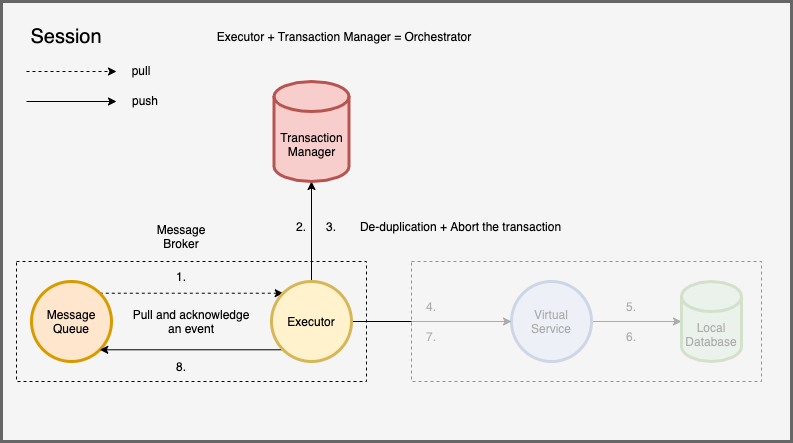
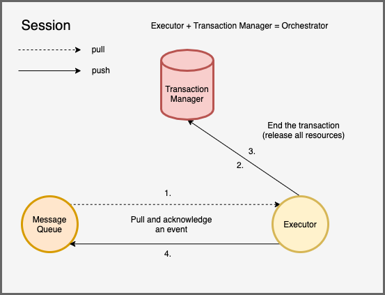

# Hierarchical Saga Transactions

This is the final project of the course 2022 NTUEE Fault-Tolerance Computing. 

**Note:** We write a simulator in Go to simulated distributed services because of the short duration of a semester. We envision a realistic architecture using containers and Kubernetes for deployment.

## Introduction

Our goal is to apply fault tolerance to must-complete distributed transactions in the microservice architecture. As software systems become increasingly complex, many of them turn toward distributed architecture. With the help of virtualization and containerization, microservice architecture is adopted by many systems. In microservices, data are partitioned into several business domains to form a loosely-coupled architecture that can be updated and deployed independently. This also increases the modularity of the entire system, leading to less maintainence effort and faster deployment speed. Although most operations can be done within the same business domain, it is hard to perform traditional ACID transactions because of the possibility of network partition as data become distributed across several databases. The distributed nature results in uncertain behavior of a transaction.

This problem is especially serious in some critical system, including e-commerce websites. For example, if a customer had already complete a payment process while the system encounter a failure before this payment is persisted and the record is completely lost, it could lead to severe damage to customer relationship. As more and more third-party service integration is used in today's websites, this problem could happen more frequently because most of them are not idempotent. To prevent this type of problems, it is crucial to design a fault-tolerance mechanism to deal with this situation.

Among the previous methods, all of them focused on data consistency and isolation, in order to avoid the unstable states of distributed systems while executing transactions to be read; however, these methods cannot deal with technical errors, they can only roll back transactions due to business errors, product out of stock, for example. We would like to design a fault tolerant system that can recover the system even in the face of techinal errors including power failures, network partitions, and so on. 

The developer could choose to avoid using global gransactions (GT) but using local transactions (LT) instead to improve concurrency and performance at the cost of data consistency. We simply provide a way to enforce the correctness of distributed transactions. Our purpose mainly focus on fault-tolerance instead of data consistency and isolation. However, we provide a draft of a design to maintain the causality of operations, which is discussed in the last section.

## Code Template

### Types

```go
type ActionInfo struct {
	ResourceID string
}

type EventHeader struct {
	TxID string
	TxType string
	Nonce int
	WaitGroupID string
	Service string
	NextService string
	Endpoint string
	Stage string
	State int
	Action int
	ActionInfo ActionInfo
	CurrentRetryTime int
	RemainingRetryTime int
	CallStack []string
}

type EventBody map[string]interface{}

type Event struct {
	Header EventHeader
	Body EventBody
}

type EventFunc func(e Event) (Event, error)

var StageTable = map[string]map[string]EventFunc
var EventQueue = Queue{}


// client: a random number generator
func RandGen() int {
	// generator random number
	return random_number
}

// client: an EventFunc
func XXX(e Event) (Event, error) {
	tx := NewTransaction("<database>")
	tx.Start()
	
	defer func() {
		// no effect if already commited
		tx.Abort()
	}()
	
	// deduplication => key: (TxID, Nonce)
	if err := tx.Insert("<table>.meta", e.TxID, e.Nonce); err != nil {
		// just ignore the message
		// as there is another writer that is manipulating the data
		return e, err
	}
	
	// tx reads
		
	// semantic Locking for writes (cannot perform range locks)
	// developers can choose whether to require a lock or just blind write
	if err := tx.Update(
		"<table>.data", "${NeedLock} && TxID == ${e.TxID} && State != ${StatePending}",
		data...); err != nil {
	   // acquire a lock and then retry the transaction
	   e.Action = ActionLock
	   e.ActionInfo = ActionInfo{
	   		ResourceID: "XXX-YYY"
	   }
		return e, err
	}
	
	if err := tx.Commit(); err != nil {
		// retry the transaction
		return e, err
	}
	
	// call children services
	events := []Event{}
	for i := 0; i < k; i++ {
		events = append(events, getChildEvent(i, e))
	}
	
	var somethingWrong bool
	var wg sync.WaitGroup
	wg.Add(k)
	for _, event := range events {
		go func() {
			defer() {
				wg.Done()
			}()
			if err := SendEvent(EventQueue, event) {
				somethingWrong = true
			}
		}()
	}
	wg.Wait()
	
	if somethingWrong {
		return e, ErrCallFailed
	}
	
	return e, nil
}

func getChildEvent(child int, e Event) Event {
	newEvent := e.Copy()
	newEvent.SetNonce(RandGen())
	switch child {
	case 1:
		newEvent.Add("key1", value1)
	
	case 2:
		newEvent.Add("key2", value2)
		
	...
	
	}
	
	return newEvent
}

// client framework
func EventDispatch(e Event) {
	stageFunc := StageTable[e.Endpoint][e.Stage]
	newEvent, err := stageFunc(e)
	if err != nil {
		switch err {
		case ErrUnrecoverable, ErrUnknown:
			newEvent.State = StateRejected
		case ErrResourceBusy:
			// do nothing
		case ErrCallFailed:
			// do nothing
		default:
			newEvent.CurrentRetryTime++
			newEvent.RemainingRetryTime--
			if newEvent.RemainingRetryTime == 0 {
				newEvent.State = StateRejected
			}
		}
		SendEvent(EventQueue, newEvent)
		return 
	}
	
	// mark the sub-tree as done
	if len(CallStack) == 0 {
		newEvent.State = StateDone
	}
	
	SendEvent(EventQueue, newEvent)
	return 
}

// tx manager
var WaitQueues map[string]PriorityQueue

func ProcessEvent(e Event) {
	mu.Lock()
	defer mu.Unlock()
	
	switch {
	// distributed locking
	case e.Action == ActionLock:
		if !TxCompleted(e.TxID) {
			if lease, ok := GetLease(e.ActionInfo.ResourceID]); ok {
				lease.Add(e)
			} else {
				lease := NewLease()
				lease.SetTime(GetLeaseTime(e))
				lease.Add(e)
				lease.Start()
			}
		} else {
			SendEvent(EventQueue, e)
		}
		
		
	// distributed waitgroup (parent)
	case e.Action == ActionWait:
		
	
	// distributed waitgroup (children)
	case e.State == StateDone && e.ParentID:
	default:
		
	}
}

type Lease struct {
	queue Queue
	t Time.Time
	doneCh <-ch struct{}
}

func (l *Lease) Add(e) {
	l.queue.Push(e)
}

func (l *Lease) Start() {
	// store to database
	l.Persist()
	
	go func() {
		for {
			select {
			case <-doneCh:
				break
			case <-Time.After(l.t):
				Unblock(k)
			}
		}
		
	}()
	return 
}
```

### Distributed Waitgroup


## Related Work

- [SagaMAS: A Software Framework for Distributed Transactions in the Microservice Architecture](https://ieeexplore.ieee.org/abstract/document/8645853)
    - Provides a good formalized transaction model
    - Use agent at each service to handle distributed transactions (semi-orchestrated)
- [Enhancing Saga Pattern for Distributed Transactions within a Microservices Architecture](https://www.mdpi.com/2076-3417/12/12/6242)
    - Data Isolation using quota queue and commit-sync service
- [Limits of Saga Pattern](https://www.ufried.com/blog/limits_of_saga_pattern/#fnref:2)
    - Only handle business error, not techinal error
- [Application-Level Locking](https://stackoverflow.com/questions/5436021/implementing-application-level-locking)
- [2PC*: a distributed transaction concurrency control protocol of multi-microservice based on cloud computing platform](https://link.springer.com/content/pdf/10.1186/s13677-020-00183-w.pdf) 
- [Event-based data-centric semantics for consistent data management in microservices](https://dl.acm.org/doi/abs/10.1145/3524860.3539807?casa_token=101CsEviepkAAAAA:ZJb00U-bd7XInIMk9O6-pyS8UHveeJAAaEroeWHedRF2l0UJAXyVcJvkKgmLNiPoFmFBV5Nqi60dXQM)

## Transaction Model

We define the transaction model as the following to simplify the reasoning process.

### Architecture

 

### Assumptions

- **Microservice architecture**
  - A gateway to receive requests and return them to users.
  - A set of services and corresponding databases, each services may have multiple instances.
  - A coordinator, also a message broker, with a queue and control instances to dispatch events, and implement consistency requirements including distributed concurrency control.
  - A central data store to store globally visible information that spans across multiple services (there can be several databases, but only shown one in the architecture picture), such as causality relationships.
  - **Note**: this architecture is also a kind of *decentralized data management* as actual data do not cross the boundary of each service. The central data store only stores control information used for transactions.
- **Event-based architecture**
  - Asynchronous execution to reduce failure surface. If we use synchronous style, all related service must be online simultaneously.
  - Message queue, message broker as storage and executor.
  - Messages are only passed through synchronous method like HTTP or gRPC in the basic unit (more details later).
  - The communication between each component is through an **event**: a set of key-value pairs, usually in the form of json, xml, or protocol buffer.
  - **Note:** for APIs directly contacting each single service, they could either be implemented synchronously or asynchronously.
- **Heterogeneous environment**
  - RDB, KV store, Document DB, Time series DB, Event Store...
  - Bare-bone machine, virtual machine, containers, ...
- **Database Constraints**
  - All databases are durable, i.e. once a data is **commited** to the database, it will not disappeared on failures.
  - All local transactions performed by databases are **atomic** (*all-or-nothing* atomicity).
  - Some database may not support transactions, but all single operation in any database are **atomic** (*all-or-nothing* and *before-or-after* atomicity). One can relax this constraints but it will cause some degree of inconsistency.
  - **Note:** the developer **must** choose a database that support transactions or it could lead to some level of inconsistency.
- **Default configuration**
  - The location of the message broker, central data store (only visible to the coordinator), ...
  - Default retry configuration, the number of instances, ... 

### Requirements

- Each request that utilizes this mechanism (global transaction, GT) is gauranteed to complete all of the operation. However, for read/write that happens only outside of this mechanism (local transaction, LT) may cause certain degree of inconsistency. This is reasonable in order to improve performance and prevent blocking of the database in network partition.
- The execution time of the each request is bounded, usually within several hours.
- Allow rollback to a certain point when facing errors. If this transaction is commited, it would not allow rollback. That is, a transaction call rollback before the commit point, or it must proceed until the end.
  - The integration with third-party services or non-idempotent actions usually cannot rollback or it will lead to unexpected consequences.
- Allow intervention of developer (to manipulate the state of the execution context).
- Need the ability to deal with several types of errors
  - Business errors: the program logic is correct, but an user performed an illegal operation.
  - Techinical errors: the program logic is still corrects, but it will subject to the interaction between components and environments, e.g. network partition, power failure, memory killer, ...
  - Logical errors: the program is buggy, e.g. infinite loop.
- Prefer transparent to each service (by using agent, middleware, or application framework).
- Prefer easier programming style.

### Execution Model

- A tree of nodes starts from the root node.


- A global transaction can be composed of nonterminal or terminal transaction (local transaction).
- A nonterminal node can be described as a sequence of terminal nodes


- A terminal node can be described as a tuple of `(Service, Endpoint, Action, Stage, Input, Output, Next Service)`.
    - `(Payment, /v1/payment, retry, 3, input {}, output {}, Order)`


### Execution Context

- Transaction ID
- Start Time
- End Time (optional)
- Current retry Time
- Time to Live (total retry time + service time)
- Trace stack (stages had been executed)
- Rollback stack (compensation stages)
    - [payment/v1/rollback, order/v2/order/rollback]
- Next Stage (Service, Endpoint, Action, Version, Stage, Input)
- State (`BEGIN`, `PROCESSING`, `COMMIT`, `ABORT`, `END`)
- Action (`NONE`, `CHECKPOINT`, `ROLLBACK`, `RETRY`, `INSPECT`)
- [custome fields ...] (optional)

```json
{
  "transaction_id": "TX123456789",
  "start_time": "XXX",
  "end_time": "YYY",
  "retry_time": 3,
  "ttl": 50,
  "trace_stack": ["Payment:/v1/payment", "Order:/v1/order"],
  "rollback_stack": ["Payment:/v1/payment/rollback", "Order:/v1/order/rollback"],
  "next_stage": "Customer:/v1/customer:1",
  "state": "COMMIT",
  "action": "CHECKPOINT",
  "input": {
  	"...": "..."
  },
  "custom_config": {
  	"...": "..."
  }
}
```

### Execution Behavior

- The root generates a transaction id and add start time.
- The final node make the end time.
- A nonterminal node can mark the transaction as commit or abort, then the coordinator would do the corresponding processing.
- Each node take the input from the context and output the next stage information including the output data
- Each node add the stage information (Service, Endpoint, Action, Stage) to the trace stack.
- Each node add the rollback information (Service, Endpoint, Action, Stage) to the rollback stack.
- Each node decrease the TTL by 1 after processing.
- If the exection failed as this stage, the retry time is decreased by 1. If success, then mark current retry time as -1.
- If the node see the current retry time is -1, then mark the current retry time as the default retry time for that service.
- If either TTL or retry time becomes 0, or any error occurs (rollback or cancel), the execution ends.

## Mechanism

In this section, we would discuss a mechanism step-by-step to deal with the possible error in the fault model in detail. 

**Note:** 

- In our model, the distributed transaction is implemented through event-based systems. The user will receive acknowledgement after our system has confirmed that the request is save in our data store. The request is executed asynchronously with best-effort.
- The **central data store** is not a off-the-shelf database but a specialized database which has transaction support, read/write coherence management, and some other features. We provide a draft for such a design. We could also use a database with ACID support to provided a subset of the fault-tolerance in our context.

### Fault Model

This fault model mainly deals with the faults from the environments of the interactions between components. The logic error of the execution flaws are not considered. This type of error need to be addressed by the developer itself or through some verification processes like testing.

There are 3 types of errors:

- Business Error:
  - This type of error is valid from the viewpoint of our systems. It can be viewed as a non-error transaction with the business rollback stage as a non-terminal node. We would not discuss this type of error in the context.
- Technical Error:
  - Service Failure: the service is temporarily shutdown or crashed.
  - Network Partition: the network connection failed when communicating with another components.
  - We are able to distinguish these two conditions because network partition usually result in timeout error rather than not-found error. We mainly deal with this type of error in our system.
- Logical Error:
  - The most notable error in this category is programming bugs like infinite loop.
  - This type of error is only mentioned a little bit during our discussion.

### Basic Unit

We can decompose the operation sequence into basic units, made up of sender and receiver. We deal with communication error in this section and assume that each side has the ability to deal with errors. There are 4 possibilities that the basic unit can fail.


**Normal Operation:** The sender first does some works and then send a message to the receiver. The receiver processed the event and sends a response back to the sender.

(1) The sender fails to process the event before the message is sent to the receiver. The sender have to design its own mechanism to handle the error while retrying the request.

(2) While the communication breaks (either each side failed or network partition), it behaves like (1). Just retry.

(3) The receiver receives the message but the processing failed in the middle. In this case, the receiver must save the state of processing (if not idempotent) in terms of the next retry request.

(4) The processing completes but the acknowledgement fails in the response (either each side failed or network partition). It behaves like (3). However, the request is already completed. The receiver must design a mechanism to deal with duplicate request.

By formulating these type of request, we can simplify our reasoning in the following section.

**Note:** The only difference between the two paragraph is that the event is pushed or pulled from the source. The fault-tolerance mechanism is actually equivalent.

### Prepare Phase

There must always be a prepare phase before the start of a transaction. This phase conduct some works to enable failure recovery. In theory, this phase can combine with the *Begin Phase* but it will complicate the handling so we decide to separate them to two different stages.


**Normal Operation:** When a service endpoint receive a request, it first issues a local transaction to store the needed information in the local database. Then it directly sends acknowledgement back to the user. The background thread of the service will periodically pull the local database and send a `BEGIN` event with necessary transaction information (see *Execution Context* in the section *Transaction Model*) to the message queue that can be retrieved by the executor.

(1), (2) The service issues a transaction to save the necessary information (indexed by transaction ID). Since it leverage the local transaction, it is safe to retry the transaction on failures. In these steps, we just retry the same operation until success. Usually, this kind of operation is implemented either using read-then-insert or directly upsert command. We can handle the error message (if the entry exists) and then just return success.

(3) The background thread fetchs all unsent events from the local database, marks them with `BEGIN` state and put them in the message queues. In production, there will be several instances that doing the same things. To prevent race condition, which leads to duplicate messages, we put the deduplication mechanism at the begin phase.

(4), (5) As each put in the message queue is atomic, just like transactions, we can treat (4), (5) as a whole. Just retry putting the event.

(6) After the event is sent to the message queue, the service marks the state of the transaction as complete. We can implement by directly delete this entry or just marked it as complete. If we implement removing strategy and we receive an error when removing a non-exist entry, we know that this is an duplicate event and can just ignore it. If (6) failed, then it will lead to duplicate events. We leave this problem to *Begin Phase*.

**Example:** After the user pays the order, the third-party service will send a request through the given callback, and it will stop sending until we acknowledge that we have already received it. The service first save all the needed information in the local database so that the next time the user request relevant information (like the status of the order), they can see the needed information. If something fails during this process, since the service has yet acknowledge to the third-party service, it is safe to retry this operation. 


### Begin Phase

In this phase, our mission is to deduplicate the same messages and coordinate the conflicting events that may have causality relationships.


**Normal Operation:** The executor read an event from the message queue. If the event is a `BEGIN` event, then it create a new entry in the transaction manager (issue a transaction). The transaction manager will asynchronously examine the causality relationships and allocate a ticket of execution to that entry. The executor then acknowledges the message. When in this ticket turn, the transaction manager sends an event to the message queue. 

(1) The executor pulls an event from the message queue. On failures, just retry.

(2), (3) The executor issues a transaction to the transaction manager. The transaction manager creates a new entry, asynchronously resolves the causality relationship, and return the response to the executor. If the transaction manager fails, since it implements atomic operation, it is safe to retry. If the executor fails or communication link breaks, because our use of transaction, it is also safe. In terms of duplicate events, if the executor finds an existing entry in the transaction manager (transaction ID, error messages from the transaction manager), it removes the event (by simply acknowledgement) from the message queue. As each opeartion in the transaction manager is atomic, this operation is correct.


(4) The executor acknowledges the event and remove it. If this operation fails, by (3), it can just retry.

(5), (6) In the ticket turn, the transaction manager will send an event (`PROCESSING` state) to the message queue. If this fails, because the message queue support atomic operation, it can simply retry.


### Processing Phase

After the *Begin Phase*, the transaction enters a chain of *Processing Phase*. 

**Note:** The *Local Database* here may be any non-idempotent external service, including a database or a third-party API. We just illustrate it as a database for convenience.


**Normal Operation:** The executor pull an event from the message queue and then issues a transaction to the transaction manager to deduplicate the event (see *Discussion* for more description). If the event is in `PROCESSING` state, then the executor sends a request based on the given endpoint. After the virtual service completes the operation, the executor first composes a new event and sends it to the message queue and then acknowledge the old one.

(1) The executor failed to pull an event from the message queue (or failed before (2)). It can just retry. 

(2), (3) To deal with the duplicate retry, we consult the transaction manager. The transaction manager will only allow a single event for every operation stage. Basically, it uses a 3-tuple (`TXID`, `Stage`, `NONCE`) to deduplicate events. See *Discussion* for detailed reasoning of this method.

(4) The communication link failed between executor and virtual service before making any permanent change. Like (1), just retry.

(5), (6) Because of the local transaction, the virtual service is safe to retry.

(7) The virutal service failed to send the response back to the executor due to some failures. As the change is commited, it could either retry the entire operation or rollback. We decide to retry and entire operation and perform deduplication. Please see (2).

(8) This situation is similar to (7) because both components are stateless. If the new event is sent but the old one is failed, it doesn't matter as we are safe to retry the request. Another possibility is that no event had been sent because of failures of the executor. In both cases, we have to add some additional tags to help deduplicate events. We achieve this by incrementing the `STAGE` and generate a `NONCE` using a random number generator in the message metadata. These fields can help the transaction manager to deduplicate the events. See (2).

**Note:** the *virtual service* here means a logical unit that has only one local transaction. If an endpoint originally initiates many non-idempotent changes, including a local transaction, a non-reversible third-party API, and the like, it should divide them into multiple virtual services. This could be implemented using application framework. See *Simulation* for more description.

### Commit Phase

The *Commit Phase*  is similar to the *Processing Phase*. The only difference is that when seeing a `COMMIT` state and `CHECKPOINT` action in the metadata (see *Execution Context*), it will release the locks of the transaction manager (see *Discussion*).


**Normal Operation:** The basic operation is the same as the *Processing Phase*. However, if the state is `COMMIT` and the action is `CHECKPOINT`, the executor will clean up the resources (equivalent to release the lock) before the commit point at the beginning of the **NEXT** stage along with the deduplication process. 


(1), (4), (5), (6), (7), (8) See the *Processing Phase*.

(2), (3) Beside deduplication process, the transaction manager is informed to clean up the resources before the commit point. With local transaction, we are safe to retry this operation. Also, the transaction manager also stores the latest commit point so if the duplicate transaction arrives, it can return an error message so that the executor can safely discard this event.

**Note:** 

- When to commit? The commits points are marked by the **control endpoint**, which is actually the first endpoint. The initial endpoint is not only an entry point of the transaction, but also serves as the control of the service request and response. See *Discussion* for more information.
- There are many other actions that can happen in the commit stage:
  - When the action is `NONE`, it only signifies the transaction is committed.
  - When the action is `ROLLBACK`, which means the normal operations suffers from severe failures. The coordinator then starts rollback until the previous commit point.
  - When the action is `RETRY`, just retry this operation. (Can simply discard the response and let the entire operation pulled from the message queue.)

### Abort Phase

The *Abort Phase* is similar to both *Processing Phase* and *Commit Phase*. If a user issues a request that forces the transaction to stop, then it could abort the transaction and reverses all the change. After rollback operations, the transaction will go to the *End Phase*.

**Note:** The abort operation can happen due to programming error programming errors (like infinite loop) or explicit abort request from the user. The former one is contained in the metadata of each event and the latter one is stored in the transaction manager. If the executor see such abort flag in the transaction manager, it can abort the operation. 


**Normal Operation:** The basic operation is the same as the *Processing Phase*. However, if the state is `ABORT`, or the flag is turned on at the beginning of the **NEXT** stage, the executor starts the rollback procedure. It first pops the top of the `rollback_stack` and set the next stage to the rollback endpoint. On each rollback stage completion, it pops another entry in the stack until the stack is empty. This is just like what the *Processing Phase* does but with the stage endpoint subsituted by the rollback endpoint. When the stack is empty, the executor set the state to `END` and enters the *End Phase*.

(1), (2), (3), (4), (5), (7) See the *Processing Phase*.

(6) If the background thread had not updated the status of the event, it fine. It simply waits for the next round. If the checking failed, because this component is stateless, just retry.

**Note:** If the event has been commited, even if the transaction shows the as `ABORT`. To explicitly kill the transaction (which is issued by the administrator), the central data store must show the state as `KILLED` rather than `ABORT`.

### End Phase

Just before the transaction end, there will be an `END` event sent by the last service. The coordinator will clean up the resource and complete the transaction when encounter this type of event.



**Normal Operation:** The coordinator pulls an event from the message queue and find that this is an `END` event. It issues a cleanup request to the central data store to free allocated resources and then also cleanup the event in the message queue.

(1) The coordinator failed to pull the event from the message queue. This case has no effect, and the coordinator will keep pulling until success.

(2) The cleanup event is lost during the communication. It behave like (1), just retry as the coordinator only maintain no state in memory and is idempotent.

(3) The cleanup response is lost. The coordinator will retry the clean up request. Once success, it will receive an not-exist error message in response. The coordinator thus knows that the resources had already been cleaned up and proceeds to acknowledge the event.

(4) The communication breaks when transmitting the acknowledge message. It just behaves like (3) and retry until the event is acknowledged and removed from the queue.


## Simulation

### Implementation

```go
type Payment struct {
    
}
```

```go
type Order struct {
    
}
```

```go
type Customer struct {
    
}
```

### More Realistic Architecture

TODO

## Discussion

### Implicit Assumption

### Central Data Store

### 


